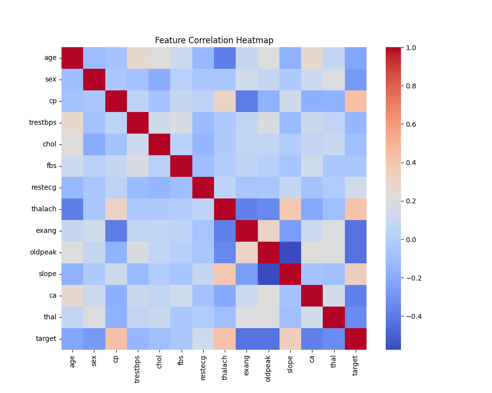
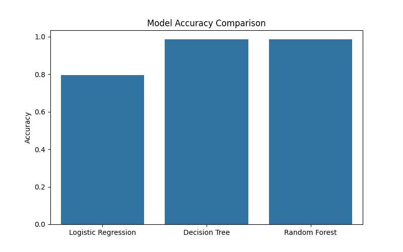
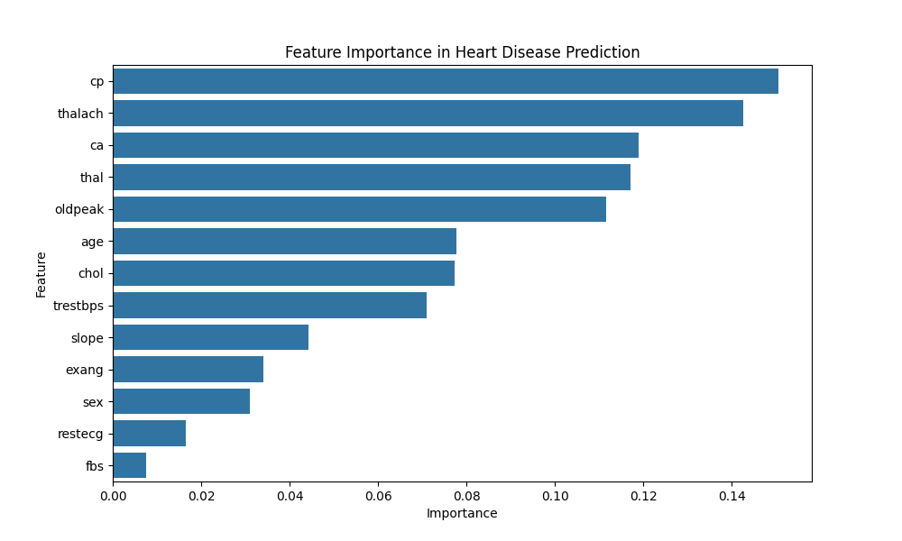

# Heart Disease Prediction using Machine Learning

This project applies machine learning techniques to predict the likelihood of heart disease based on patient health attributes. The goal is to explore healthcare data, perform exploratory data analysis, and evaluate multiple machine learning models for prediction.

---

## Project Overview

Heart disease is one of the leading causes of death worldwide. Early prediction using machine learning can help healthcare professionals identify high-risk patients and take preventive measures.

In this project, several machine learning algorithms are trained and compared to determine which model performs best for predicting heart disease.

---

## Technologies Used

- Python
- Pandas
- NumPy
- Matplotlib
- Seaborn
- Scikit-learn

---

## Dataset

The dataset contains medical attributes such as:

- Age
- Sex
- Chest pain type
- Resting blood pressure
- Cholesterol level
- Maximum heart rate
- Exercise induced angina
- ST depression
- Number of major vessels
- Thalassemia
- Target variable (presence of heart disease)

Dataset Source: UCI Machine Learning Repository.

---

## Machine Learning Models Implemented

The following models were trained and evaluated:

- Logistic Regression
- Decision Tree Classifier
- Random Forest Classifier

Model performance is compared using **accuracy scores**.

---

## Exploratory Data Analysis

Several visualizations are generated to better understand the dataset:

- Feature correlation heatmap
- Model accuracy comparison
- Feature importance analysis

---

---

## Key Insights

- Certain clinical features strongly influence heart disease prediction.
- Random Forest typically performs better due to its ensemble learning capability.
- Feature importance analysis highlights the most influential medical factors.

---

## Visualization Examples

### Correlation Heatmap

### Model Accuracy Comparison

### Feature Importance

---

## Future Improvements

Possible improvements for this project include:

- Hyperparameter tuning
- Cross-validation
- Deep learning approaches
- Deployment as a web application

---

## Author

Fasila Ansari

